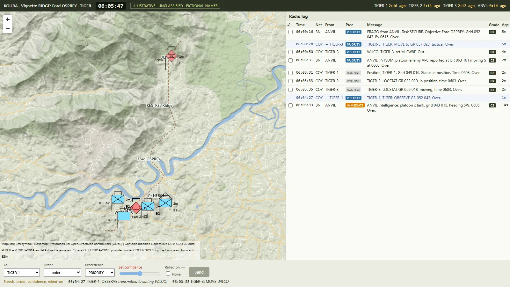
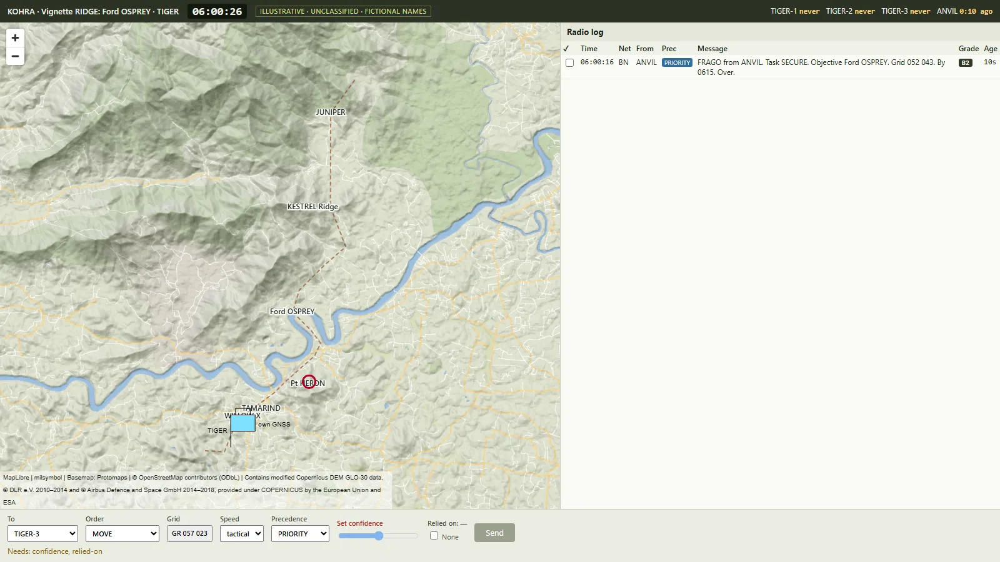
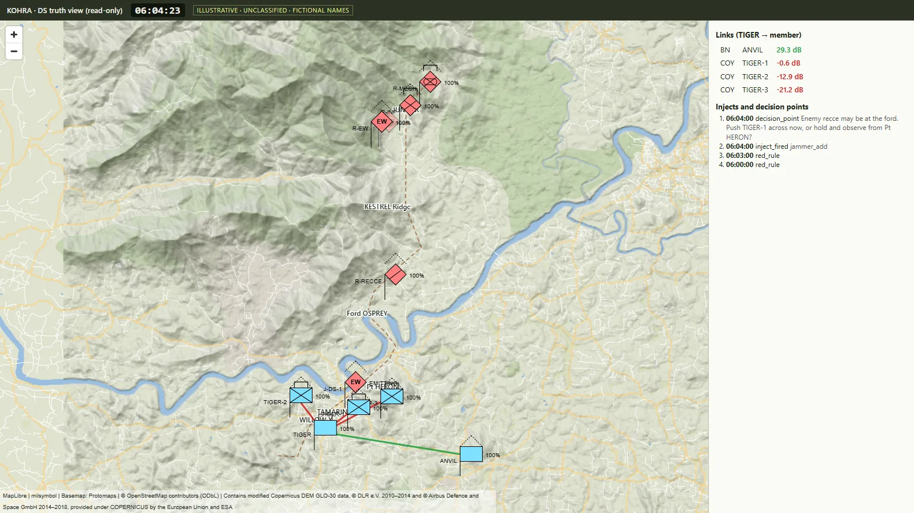
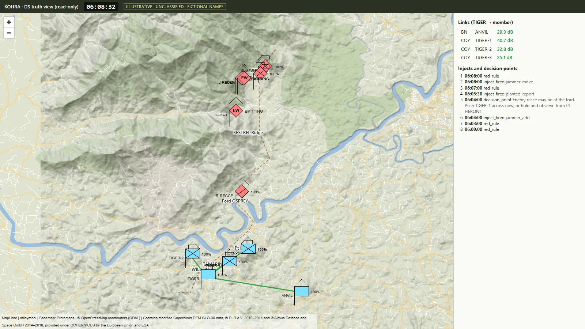

# KOHRA

**A fog-of-war trainer that separates what jamming cost from what the commander missed.**

Team LatentX (IIIT Bangalore) · Smart India Hackathon 2026 · Problem statement **SIH26248**, Ministry of Defence (Defence Services Staff College): an immersive multi-domain decision-making trainer for degraded communication environments.

> **ILLUSTRATIVE · UNCLASSIFIED · FICTIONAL NAMES.** This is a training aid, not a validated RF or combat model.



## What it does

KOHRA puts a company commander in a 12-minute vignette where information is **incomplete, delayed and contradictory**, and records every decision they make.

- **Hidden truth.** A seeded, deterministic simulation runs on real terrain: Copernicus elevation plus OpenStreetMap, in an interior box in peninsular India. Every place name is a fictional codename.
- **Imperfect sensing.** Platoons see the enemy only within range and line of sight. What they see becomes templated radio reports (CONTACT, LOCSTAT, SITREP, …), each graded for reliability and credibility (A–F × 1–6).
- **Degraded comms, from physics.** Messages travel over simulated VHF nets. Whether a message arrives depends on terrain (hills block signals) and on where enemy jammers are. Messages can arrive late, garbled, or not at all.
- **The commander sees only what arrives.** Enemy contacts carry an age and a grade. Own platoons appear only when they report their position. "Last heard" timers show who has gone silent. **Every order must state a confidence and the reports it relied on.**
- **The instructor fights back live.** The instructor can drop or move a jammer, cut or delay a net, plant a false report, or start GPS spoofing, all mid-exercise. A read-only truth view (`/ds`) shows what is really happening.
- **Replay.**
  - Every command is logged in a tamper-evident, hash-chained log.
  - Replaying the log reproduces the exact same state hashes, including the final one.
  - So an after-action review always shows what really happened.

## Quick start (about 10 minutes)

You need **Git**, **Node.js 20 or newer** and **uv**, which installs Python 3.12 for you.

**Windows (PowerShell):**

```powershell
winget install --id Git.Git -e; winget install --id OpenJS.NodeJS.LTS -e; winget install --id astral-sh.uv -e
# close and reopen PowerShell, then:
git clone https://github.com/Lohith248/latentx-kohra.git
cd latentx-kohra
uv sync --extra terrain
uv run python scripts/demo.py
```

**Linux / macOS:**

```bash
curl -LsSf https://astral.sh/uv/install.sh | sh     # Node 20+ from nodejs.org or your package manager
git clone https://github.com/Lohith248/latentx-kohra.git
cd latentx-kohra
uv sync --extra terrain
uv run python scripts/demo.py
```

On the first run, `demo.py`:
1. offers to download the real terrain (about 50 MB, one time; answer **Y**);
2. builds the web client;
3. starts the server, opens the **player** screen in your browser, and prints the **instructor (DS)** URL.

Open the DS URL in a second window, placed side by side with the player screen. If the download is blocked, the demo falls back to synthetic terrain and shows a red banner.

Options:

```bash
uv run python scripts/demo.py --speed 2                    # 1x to 4x real time
uv run python scripts/demo.py --headless --speed max       # no browser: bot player, ~1 s, prints REPLAY OK
uv run python scripts/demo.py --port 8800                  # if 8765 is busy
```

## What you'll see in the demo

The game clock runs 06:00 to 06:12. Instructor injects fire automatically, from `scenarios/demo_injects.yaml`:

| Clock | What happens | Where to look |
| --- | --- | --- |
| 06:00 | Battalion HQ (ANVIL) orders TIGER to secure Ford OSPREY | Radio log |
| 06:00–06:04 | You move platoons: pick a platoon and an order, click the map, **set confidence**, choose the reports you relied on, Send. Send stays disabled until all of these are set | Orders panel |
| ~06:03 | Enemy contacts appear from platoon reports, each with an age and a grade | Map, radio log |
| **06:04** | **A jammer drops in among the company.** Company-net links turn red in the DS view; on the player screen, WILCOs stop arriving and "last heard" timers climb | DS view, top bar |
| **06:05:30** | **A planted INTSUM graded C3** reports a tank platoon at TAMARIND. It is false | Radio log (C3 badge) |
| **06:08** | The jammer moves behind KESTREL Ridge and the net recovers | DS link lines turn green |
| 06:12 | ENDEX: inputs lock, the final state hash appears, and the terminal prints `REPLAY OK <hash>` | Player screen, terminal |

| Player screen | Instructor truth view |
| --- | --- |
|  |  |
|  |  |

All ten screenshots are in [`docs/screenshots/`](docs/screenshots/).

## Run as the instructor

With the demo or server running, open a second terminal in the repo folder and use any of these:

```bash
uv run python -m kohra.cli inject jammer_add id=J-1 lonlat=76.1467,11.2213 power_dbm=47 antenna_m=6 freq_mhz=45.25 bandwidth_khz=25 mode=continuous
uv run python -m kohra.cli inject jammer_move id=J-1 lonlat=76.150,11.275
uv run python -m kohra.cli inject jammer_remove id=J-1
uv run python -m kohra.cli inject net_cut net=COY duration_s=60
uv run python -m kohra.cli inject net_delay net=BN extra_s=20 duration_s=120
uv run python -m kohra.cli inject planted_report net=BN from_callsign=ANVIL to_callsign=TIGER template=intsum "fields={size: platoon, unit_type: tank, grid_from_place: TAMARIND, direction: SW, time: auto}" grade=C3 precedence=IMMEDIATE
uv run python -m kohra.cli inject gnss_zone_add id=G-1 lonlat=76.137,11.209 radius_m=800 bearing_deg=45 rate_mps=2 max_offset_m=400 duration_s=300
uv run python -m kohra.cli inject-file scenarios/demo_injects.yaml
```

- The CLI reads the instructor token from `.kohra/tokens.json`, which is created at server start and never committed. A player token is refused.
- Add `at_tick=N` to schedule an inject at an absolute tick.
- To run the server on its own: `uv run python -m kohra.cli run --speed 1`. Add `--host 0.0.0.0` for LAN play.

**Replay and verify a run log:**

```bash
uv run python -m kohra.cli replay runs/<log>.sqlite         # REPLAY OK <hash>, or the first mismatching tick
uv run python -m kohra.cli verify-chain runs/<log>.sqlite   # checks the SHA-256 chain
```

## How it works

```
 scenario.yaml ──► truth engine (fixed 1 s tick, pure step function, seeded RNG streams)
                     │ terrain · movement · detection · outcomes · scripted red and blue
                     ▼
                   reports (templates × 3 phrasings, A–F × 1–6 grades)
                     ▼
                   comms layer (path loss + knife-edge over the DEM, jammer SINR at the receiver,
                     │          delivery odds, garbled fields, precedence queue, GNSS walk-off)
                     ▼
                   perception store ──► view_for(player) ──► player browser (only what arrived)
                     │
                     └──► hash-chained SQLite log ──► replay ──► identical state hashes
```

- **Delivery probability** = logistic(a × (SINR − θ)), using the worst SINR over the message's airtime.
- **Path loss** = max(free-space, plane-earth at 40 dB/decade) + knife-edge diffraction where terrain blocks the line of sight.
- **Intermittent jammers** pulse as a Gilbert–Elliott chain. Delay comes from a separate precedence queue.
- **No AI model is used anywhere in live play**, so every exercise is reproducible.
- More detail, with the reasons behind each choice, is in [docs/DESIGN_NOTES.md](docs/DESIGN_NOTES.md).

## Tests

```bash
uv run pytest -q                                   # 157 tests
uv run mypy --strict -p kohra.sim -p kohra.comms -p kohra.reports -p kohra.observe -p kohra.log
uv run ruff check .
cd client && npm ci && npm test && npm run build && npx playwright install chromium && npx playwright test
```

Key tests:

| Test | Proves |
| --- | --- |
| `test_replay_hash.py` | A 30-minute run replays to identical hashes at every 60th tick; two separate processes agree; a one-byte log edit is caught |
| `test_no_truth_leak.py` | Hidden markers on every truth unit never reach the player's connection |
| `test_channel_stats.py` | Over 10,000 messages, the delivered share is within 5 % of the configured odds; jammer bursts have the right statistics |
| `test_link_geometry.py` | A ridge adds about 20 dB of loss; doubling jammer distance gains 12 dB; a jammer behind a ridge loses its effect |
| `test_orders_confidence.py`, `e2e/orders.spec.ts` | No order can be sent without a confidence and a relied-on choice |
| `e2e/offline.spec.ts` | The map renders with **zero** requests leaving the server |

Python tests need built terrain (real or synthetic); run `uv run python scripts/synth_terrain.py` once if you skipped the demo.

## Repository layout

```
server/kohra/   app.py rooms.py views.py wire.py auth.py cli.py
                scenario/ sim/ comms/ reports/ observe/ log/
client/         React + Vite + MapLibre + PMTiles + milsymbol; e2e/ (Playwright)
scenarios/      ridge.yaml (vignette), ridge.bot.yaml (headless player), demo_injects.yaml
config/         grading.yaml (source and credibility grades, configurable labels)
scripts/        demo.py fetch_terrain.py build_terrain.py synth_terrain.py check_scenario.py
docs/           DESIGN_NOTES.md, screenshots/
tests/          pytest suite (synthetic DEM fixtures)
```

## Roadmap

- **Now:** solo vignette, terrain-aware comms, live injects, replay.
- **Next:**
  - multiplayer roles over a LAN, with player-to-player traffic through the same comms model;
  - an instructor dashboard with an inject editor;
  - a **reference reader**: the best picture the received reports allowed;
  - belief freezes scored with GOSPA;
  - push-to-talk voice that garbles with link quality;
  - a three-picture after-action review (true, achievable, believed) with PDF export.

## Data credits and licences

- © OpenStreetMap contributors (ODbL) · Basemap: Protomaps
- Contains modified Copernicus DEM GLO-30 data, © DLR e.V. 2010–2014 and © Airbus Defence and Space GmbH 2014–2018, provided under COPERNICUS by the European Union and ESA
- MapLibre GL JS (BSD-3) · milsymbol (MIT) · PMTiles (BSD-3)

Every dependency and its licence is listed in [THIRD_PARTY.md](THIRD_PARTY.md). There are no GPL, AGPL or non-commercial components.

## Limits

- Illustrative and unclassified, with fictional names. Not a validated RF or combat model.
- No clutter model, ground constants or antenna patterns. The ITM cross-check has not been run.
- Replay is identical on the same build and platform, not across platforms.
